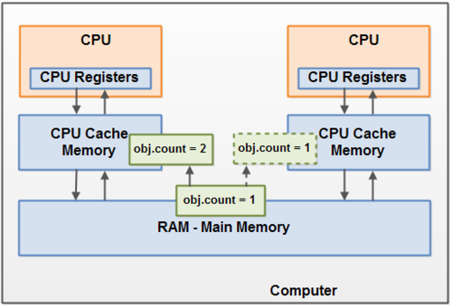

## Multi Thread 

#### Concurrency 문제의 원인

1. 원자성의 무보장
   * 자바의 변수는 메모리에 저장되어 있지만, 연산시에는 레지스터로 옮겨간 후 CPU에서 연산을 한 후, 레지스터에 있는 값을 다시 메모리에 저장을 하기 때문에 원자성을 보장하지 않는 코드인 경우 동시성문제 발생 
2. 리오더링
   * 보통 컴파일과정에서 발생하며, 프로그래머가 만들어낸 코드를 좀 더 빠르게 실행될 수 있도록 조작을 가하는 최적화과정을 뜻함. 최적화 과정 중에 읽기와 쓰기의 순서가 바뀔 수 있는데, 이로인해 동시성문제가 발생할 수 있음

#### Multi Thread의 문제 (Concurrency Problem)

1. 경쟁상태 (race condition)
   * 여러 스레드가 같은 시점의 변수를 읽는 상태
2. 변수의 가시성 (visibility)
   * 변수들이 사용될 수 있는 영역의 범위 (변수의 값을 CPU Cache Memory인지 Main Memory인지를 알 수 없는 문제) : 공유변수가 언제 CPU 캐시에서 메인메모리로 쓰일 지 보장되지 않기 때문에, CPU 캐시와 메인메모리의 변수가 다른 값을 가질 수 있음. -> 스레드가 변경한 값이 메인메모리에 저장되지 않아서 다른 스레드가 이 값을 볼 수 없는 상황

#### 원자성(Atomic)

원자성이란 여러개의 스레드가 있을 때 특정 시점에 어떤 메소드를 두개 이상의 스레드가 동시에 호출하지 못한다. 즉, 메모리에 있는 필드 변수를 읽거나 쓸 때, 어느 한 스레드의 동작으로 보장되어야 한다.

* 자바 메모리모델은 64bit인 long과 double을 제외한 기본 자료형에 대해 원자성을 보장한다. (자바에서 변수를 할당할 때 32bit단위로 끊어서 할당하기 때문이며, long과 double도 volatile로 선언된 경우 원자성을 보장한다.)
  * `int a = 0;` 은 Atomic Operation이며, `a++;`은 Non Atomic Operation이다. `a++;`의 경우에는 1. a 변수의 값을 가져온다. 2. a 변수의 값을 증가한다. 3. 변경된 a 변수의 값을 저장한다. 의 3단계의 작업으로 분리될 수 있기 때문이다.

#### Concurrency 문제를 위한 여러 방안 

1. Atomic Class 사용
2. volatile 키워드 사용 : race condition 해결 불가능
3. synchronized 블럭 사용
4. ReentrantLock 사용
   * [ReentrantLock VS Synchronized](https://stackoverflow.com/questions/11821801/why-use-a-reentrantlock-if-one-can-use-synchronizedthis)

#### Reference

* [ORACLE Threads and Locks (JAVA9)](https://docs.oracle.com/javase/specs/jls/se9/html/jls-17.html)
* [what is the differnece between atomic / volatile // synchronized](https://stackoverflow.com/questions/9749746/what-is-the-difference-between-atomic-volatile-synchronized)
* [Difference between volatile and synchronized in Java](https://stackoverflow.com/questions/3519664/difference-between-volatile-and-synchronized-in-java)