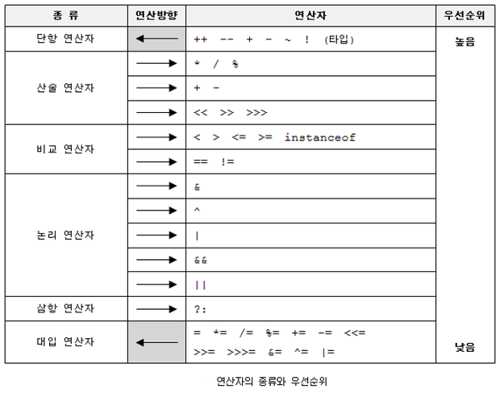

## Operator

#### 연산자 우선순위



1. 산술 > 비교 > 논리> 대입
2. 단항(1) > 이항(2) > 삼항(3)
3. 단항 연산자와 대입 연산자를 제외한 모든 연산의 진행방향은 왼족에서 오른족


#### 나머지연산자 %

1. 나눗셈과 마찬가지로 나누는 수로 0을 사용할 수 없음
2. 피연산자로 정수만 허용
3. 나누는수로 음수도 허용하지만 부호가 무시되므로 결과는 음수의 절대값으로 나눈 나머지와 같음

```java
int a = -10 % 8 // -2
int b = 10 % -8 // 2
int c = -10 % -8 // -2
```


#### 비트연산자

* |(or)는 비트를 킬 때 주로 사용
* &(and)는 비트를 추출할 때 주로 사용
* ^(xor)은 두번 연산하면 원래의 수로 돌아오므로 간단한 암호화할 때 사용
* << 와 >>는 곱셈이나 나눗셈 연산에 사용되는데 산술연산자보다 더 빠름
  * x << n은 x * 2^n과 같음
  * x >> n은 x / 2^n과 같음 


> x << n과 x >>n에서 n의 값이 자료형의 bit수보다 크면?
>
> --> 자료형의 bit수로 나눈 나머지만큼만 이동한다.
>
> --> 8 >> 32는 아무일도 하지 않으며 8 >> 34는 8 >> 2와 같다.

