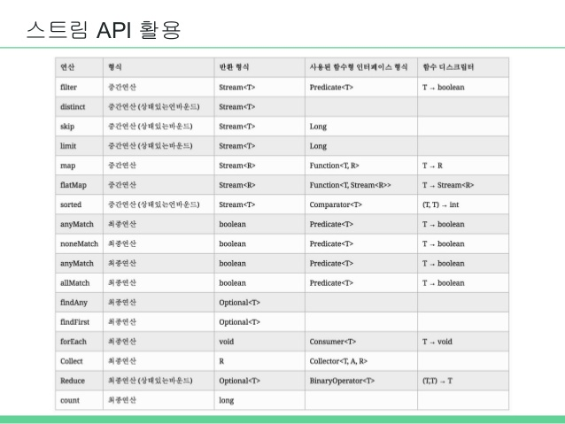

## Java8 Sream

#### Stream이란?

* 데이터 처리 연산을 지원하도록 소스에서 추출된 연속된 요소

* 선언형(즉, 데이터를 처리하는 임시 구현 코드 대신 질의로 표현 가능)으로 컬렉션 데이터를 처리

  > 선언형 프로그래밍?
  >
  > * 명령형 프로그래밍은 어떻게 해결할지에 집중하는 반면, 선언형 프로그램은 무엇을 해야 하는지에 집중
  > * 구체적인 작동 순서를 나열하지 않고, 알고리즘에만 집중할 수 있음
  > * 이미 구현된 것을 사용하므로 성능이 빠름
  > * 구체적인 작동 순서를 나열하지 않기 때문에 명령형보다 버그가 적음

* 스트림을 조작할 수 있는 다양한 연산들을 연결하여 복잡한 데이터 처리 파이프라인을 쉽고 유연하게 작성 (스트림 연산은 순차적 혹은 병렬적으로 수행 가능)

  * 스트림 연산끼리 연결해서 커다란 파이프라인을 구성할 수 있도록 스트림 자신을 반환


* 멀티 스레드 코드를 구현하지 않아도 데이터를 투명하게 병렬로 처리 가능
* 내부 반복을 지원


#### Stream 장점

1. 선언형 (가독성)

2. 조립 (유연성)

3. 병렬화 (성능)

4. 파이프 라인 형성

   > 파이프라인
   >
   > 파이프라인을 쓰면, 컴퓨터 구조는 프로세서가 산술연산을 수행하는 동안에 다음번 명령어를 가져올 수 있으며, 그것을 다음 명령어 연산이 수행될 수 있을 때까지 프로세서 근처의 버퍼에 가져다놓는다.
   > 명령어를 가져오는 단계는 끊임없이 계속된다. 그 결과, 주어진 시간동안에 수행될 수 있는 명령어의 수가 증가한다.
   >
   > 명령어1이 실행되는 동안 명령어2가 준비되고 실행되는 것


#### Stream VS Collection

* 공통점

  * 연속된 요소 형식의 값을 저장하는 자료구조의 인터페이스
  * 순서에 의해 순차적으로 요소에 접근

* 차이점

  * 연산 시점
    * Collection : 각 연산식을 만날때마다 연산
    * Stream : 최종 연산이 실행될 때 연산
  * 데이터 접근 측면
    * Collection : 자료구조이므로 데이터의 접근/읽기/변경/저장 연산이 주요 관심사이며 데이터에 접근하는 방법을 직접 핸들링해야 함
    * Stream : 계산식을 표현하는 것이 주요 관심사이며 계산식을 JVM으로 넘기므로 데이터에 접근하는 방법이 추상화되어있음
  * 데이터 계산 측면
    * Collection : 작업을 위해 Iterator로 모든 요소를 순환해야 하는데, 메모리에 모든 요소가 올라가므로 메모리 사용량이 높아지고 연산속도가 낮아짐
    * Stream : 계산식(알고리즘or람다)을 미리 명시해두고 계산시 람다로 JVM에 넘기는데, 내부적으로 요소가 어떻게 메모리에 올라가는지는 관심사가 아니며(블랙박스) 계산 요청시 결과가 바로 리턴됨 (메모리 사용량이 낮아지며 연산속도가 빨라짐)

  ​

#### Create Stream

```java
// list to object stream
List<String> list = new ArrayList<>();
list.stream();

//aray to object stream
int[] numbers = {1,2,3,4};
Arrays.stream(numbers);

//use Stream static method 'of'
Stream.of("a", "b", "c");

//use static method 'iterator' 
Stream.iterator(0, n -> n+2)
  .limit(3); //0, 2, 4

//use Stream static method 'generate'
Stream.generate(Math::random)
  .limit(10);

//int reange to IntStream(primitive stream)
IntStream.range(1, 4); //1, 2, 3
IntStream.rangeClosed(1, 4) //1, 2, 3, 4

```


#### Object Stream과 Primitive Stream

* Ojbect Stream에 비교하여 Primitive Stream은

  1. 특별한 람다 표현식을 사용

     ex) Function 대신 IntFunction을 사용하거나, Predicate 대신 IntPredicate를 사용

  2. 추가적인 단말 집계 연산들을 지원

     ex) sum() average() summaryStatistics()

     ```java
     int sum = list.stream()
       .mapToInt(Integer::parseInt)
       .sum();

     IntSummaryStatistics statistics = IntStream.rangeClosed(1,100)
       .summaryStatistics();
     // {count=100, sum=5050, min=1, average=50.500000, max=100}
     System.out.println(statistics);

     //필요에 따라 Wrapper 타입으로 변환 가능
     IntStream.rangeClosed(1, 100)
       .boxed()
       .reduce(0, Integer::sum);
     ```

* Object Stream To Primitive Stream
  * mapToInt()
  * mapToLog()
  * mapToDouble

  ```java
  Stream.of("a1", "a2", "a3")
      .map(s -> s.substring(1))
      .mapToInt(Integer::parseInt)
  ```

* Primitive Stream To Object Stream

  * mapToObj

  ```java
  IntStream.range(1, 4)
      .mapToObj(i -> "a" + i);

  Stream.of(1.0, 2.0, 3.0)
      .mapToInt(Double::intValue)
      .mapToObj(i -> "a" + i);
  ```

  ​

#### Stream 가공 순서

중간연산은 단말연산이 존재해야 실행된다.

예외적인 연산(ex.sort)들을 제외하고는 수직적으로 실행된다.

```java
// 아무것도 출력되지 않는다.
Stream.of("d2", "a2", "b1", "b3", "c")
    .filter(s -> {
        System.out.println("filter: " + s);
        return true;
    });

// 아래와 같은 결과가 출력된다.
/*
* filter:  d2
* forEach: d2
* filter:  a2
* forEach: a2
* filter:  b1
* forEach: b1
* filter:  b3
* forEach: b3
* filter:  c
* forEach: c
*/
Stream.of("d2", "a2", "b1", "b3", "c")
    .filter(s -> {
        System.out.println("filter: " + s);
        return true;
    })
    .forEach(s -> System.out.println("forEach: " + s));
```


#### Stream Operation




#### 중간연산 (Intermediate Operation)

* 중간 연산은 새로운 스트림을 반환
* Lazy(게으름) : 단말연산을 스트림파이프라인에 실행하기 전까지는 아무 연산도 수행하지 않으며, 모든 중간연산을 합친 후에 단말연산에서 한번에 처리함


#### 단말연산 (Terminal Operation)

* 스트림 파이프라인에서 결과값을 도출
  * 단말 연산을 스트림파이프라인에 실행하기 전까지는 아무 연산도 수행하지 않음
  * 중간연산 정보를 합친 다음 단말연산에서 한번에 처리
* 단말 연산을 실행하면 스트림 파이프라인은 소비되고, 재사용할 수 없음
* 스트림을 닫을 필요는 없지만 IO 채널의 경우에는 close해줘야 함


#### Stream의 재사용

Java 8 스트림은 재사용이 불가능하다. 어떤 단말 연산이든 호출하는 즉시 스트림은 닫힌다.


#### Parallel Stream

런타임 시 하나의 작업을 서브 작업으로 자동으로 나누고, 서브 작업의 결과를 자동으로 결합해 최종 결과물 생성


#### 참고자료

[Javadoc - Stream](https://docs.oracle.com/javase/9/docs/api/java/util/stream/Stream.html)

[Winterbe Blog - Java8 Stream Tutorial(en ver)](http://winterbe.com/posts/2014/07/31/java8-stream-tutorial-examples/)

[Wraithkim Blog - Java8 Stream Tutorial(ko ver)](https://wraithkim.wordpress.com/2017/04/13/java-8-%EC%8A%A4%ED%8A%B8%EB%A6%BC-%ED%8A%9C%ED%86%A0%EB%A6%AC%EC%96%BC/)