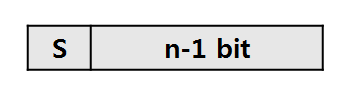

## Variance - Primitive type Structure

#### boolean

* true / false의 두 가지 값만을 표현하므로 1 bit만으로도 충분하지만 자바에서는 데이터를 다루는 최소단위가 byte이기 때문에, boolean의 크기는 1byte

> [boolean[] VS BitSet : Which is more efficient?](https://stackoverflow.com/questions/605226/boolean-vs-bitset-which-is-more-efficient)
>
> 


#### char

* 문자의 유니코드(정수, UTF16)가 저장

  ```java
  /* 모두 같은 내용 */
  char ch = 'A';
  char ch = 65;
  char ch = 0x41;
  char ch = '\u0041';
  ```

* 2 byte = 16 bit = 65536(2^16)가지의 문자 저장 가능


#### 정수형 : byte, short, int, long

* byte(1byte) < short(2byte) < int(4byte) < long(8yte)
* 정수형 primitive variance의 default data type은 int
* n bit 정수형으로 표현할 수 있는 정수의 개수 2^n개
* n bit 정수형의 값의 범위 : 2<sup>n-1</sup> ~ 2<sup>n-1</sup>-1
* 표현형식 (n bit)
  * sign bit(1 bit) : 가장 첫번째의 부호비트 (양수는 0, 음수는 1)
  * n-1 bit : 값을 표현하는데 사용



> 정수형 변수를 선언할 대는 int타비으로 하고, int 범위(약 +-20억)을 넘어서는 수를 다뤄야할 때는 long을 사용하면 된다. 그리고 byte나 short는 성능보다 저장공간을 절약하는 것이 더 중요할때 사용한다.

* byte나 short보다는 int가 더 효율적이다.
  1. byte나 short이 int보다 크기가 작아서 메모리를 조금 더 절약할 수는 있지만, 저장할 수 있는 값의 범위가 작은 편이라서 연산 시에 범위를 넘어서 잘못된 결과를 얻기가 쉬움
  2. JVM의 피연산자 스택(operand stack)이 피연산자를 4byte 단위로 저장하기 때문에 크기가 4byte보다 작은 자료형(byte, short)의 값을 계산할 때는 4byte로 변환하여 연산이 수행됨. 그래서 연산이 필요할 경우 int를 사용하는 것이 더 효율적


* long타입의 범위를 벗어날때는?
  * 실수형 타입잉나 BigInteger 클래스를 사용
* Overflow
  * 예상했던 결과를 얻지 못할 뿐 에러가 발생하지는 않음 
  * 최대값 + 1 = 최소값
  * 최소값 - 1 = 최대값


#### 실수형 : float, double

* 표현 범위

  - float(정밀도 7자리) : -3.4\*10<sup>38</sup> ~ -1.4\*10<sup>-45</sup>, 1.4\*10<sup>-45</sup> ~ 3.4\*10<sup>38</sup>


  - double(정밀도 15자리) : -1.8\*10<sup>308</sup> ~ -4.9\*10<sup>-324</sup>, 4.9\*10<sup>-324</sup> ~ 1.8\*10<sup>308</sup>

* 정밀도(p)

  * a * 10<sup>n</sup> (1<=a<10)의 형태로 표현된 p자리의 10진수를 오차없이 저장할 수 있다

    > - 1234.556 = 1.234567 * 10^3 (float 가능)
    > - 0.00001234567 = 1.234567 * 10^-5 (float 가능)
    > - 1234567000 = 1.234567 * 10^9 (float 가능)
    >
    > ----> 모두 1.234567로 7자리까지이므로 float으로 가능
    >
    > (9.1234567 와 같은 수는 float으로는 7자리인 9.123456까지만 보장되므로 double로 표현해야 함)

* 얼마나 큰 값을 표현할 수 있는가?

* 얼마나 0에 가깝게 표현할 수 있는가?

* 표현방식

  * +-M x 10<sup>E</sup>


  * sign bit(1 bit) : 가장 첫번째의 부호비트 (양수는 0, 음수는 1)

  * exponent (지수)

    * 부호 있는 정수
    * nbit로는 -2<sup>n-1</sup>-1 ~ 2<sup>n-1</sup> 의 값을 표현할 수 있으며, -2<sup>n-1</sup>-1과 2<sup>n-1</sup>은 실제로 숫자 아님(Nan, Not a Number), 양의 무한대(Positive Infinity), 음의 무한대(Negative Infinity)와 같이 특별한 값의 표현을 위해 예약되어 잇으므로, 실제로 사용 가능한 지수의 범위는 -2<sup>n-1</sup>-2 ~ 2<sup>n-1</sup>-1

    > float타입의 지수는 8bit이므로  -126~127이며 가수부는 1.xxx이므로,
    >
    > float타입으로 표현가능한 최대값은 2^127이며 10진수로는 약 10^38
    >
    > float타입으로 표현가능한 최소값은 2^-126에 가수의 마지막자리가 2^-23이므로 2^-149이며 10진수로는약 10^-45

  * mantissa (가수)

    * 실제 값을 저장하는 부분
    * float은 2진수 23자리를 저장할 수 있으므로 10진수로 약 10^7이어서 정밀도 7자리까지 보장되며, double형은 2진수 52자리를 저장할 수 있으므로 10진수로 약 10^15여서 정밀도 15자리까지 보장


* Overflow

  * 실수형 변수의 값이 표현범위의 최대값을 벗어나면 overflow가 발생하는데, 정수형과 달리 실수형에서는 오버플로우가 발생하면 변수의 값은 무한대(infinity)가 됨

* Underflow

  * 실수형 변수의 값이 표현범위의 최소값보다 작아지면 underflow가 발생하는데, 이 때 변수의 값은 0이 됨

* 부동소수점의 오차

  > 2진수로 변환된 실수를 저장할 때는 1.xxxx * 2^n의 형태로 변환하여 xxxx부분이 가수로 저장되고 기저법에 의해 n+기저 가 2진수로 변환되어 지수에 저장된다.
  >
  > float의 기저는 23, double의 기저는 1023이다.

  1. 실수형 변수가 허용하는 정밀도를 벗어나는 경우 오차가 생김
  2. 10진수가 아닌 2진수로 저장하는데, 2진수로는 10진 소수를 정확히 표현하기 어렵기 때문에 10진수로는 유한소수이더라도, 2진수로 변환하면 무한소수가 되는 경우가 있음

* 부동소수점이 2진수로 어떻게 변환되어 저장되는지 확인하고 싶을 때 

  * `floatToIntBits(float f)` : float타입의 값을 int타입의 값으로 해석해서 반환
  * `doubleToLongBits(double d)` : double타입의 값을 long타입의 값으로 해석해서 반환


#### 실수형의 비교연산

```java
10.0 == 10.0f // true
0.1 == 0.1f // false
```

10.0f는 오차없이 저장할 수 있는 값이기 때문에 float과 double에서 같은값으로 저장되지만, 0.1f는 저장할 때 2진수로 변환하는 과정에서 오차가 생기며, float보다 double에서 오차가 더 적으므로 실제로 저장되는 값이 다르다.

```java
float f = 0.1f; // 0.10000000149011612로 저장된다.
double d = 0.1; // 0.10000000000000001로 저장된다.
double dd = (double)f; /*부호와 지수는 달라지지 않고, 가수의 빈자리만 0으로 채우므로 그대로 0.10000000149011612*/
    
d == f //false
d == dd //false
(float)d == f //true
(float)dd == f //true
```

float타입의 값과 double타입의 값을 비교하려면 double타입의 값을 float타입으로 형변환 하여 비교하거나, 어느정도의 오차는 무시하고 두 타입의  값을 앞에서부터 n자리만 잘라서 비교하면 된다.


