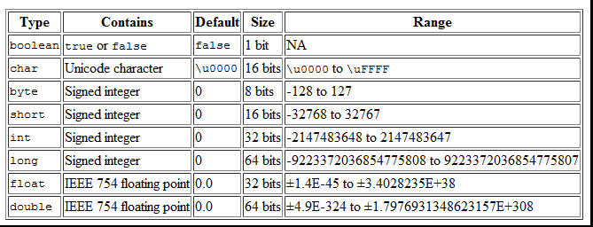

## Variance Type

#### 기본형 (primitive type)

* 실제 값(data)를 저장
* C언어와 달리 참조형 변수 간의 연산을 할 수 없으므로 실제 연산에서 사용되는 것은 모두 기본형 변수이다.
  * 정수형의 경우 02^(n-1) ~ 2^(n-1) -1 (n=bit수)


#### 실수형 변수의 정밀도

실수형은 정수형과 저장형식이 달라서 같은 크기라도 훨신 큰 값을 표현할 수 있지만 오차가 발생할 수 있다. 그래서 정밀도(precision)가 중요한데, 정밀도가 높을수록 발생할 수 잇는 오차의 범위가 줄어든다. 

| 타입   | 저장 가느한 값의 범위(양수)  | 정밀도 | bit 크기 | byte 크기 |
| ------ | ---------------------------- | ------ | -------- | --------- |
| float  | 1.4 * 10^-45 ~ 3.4 * 10^38   | 7자리  | 32       | 4         |
| double | 4.9 * 10^-324 ~ 1.8 * 10^308 | 15자리 | 64       | 8         |


#### 참조형 (reference type)

* 어떤 값이 저장되어 있는 주소(memory address)를 저장

* 참조변수의 타입은 클래스의 이름

  * '새로운 클래스를 작성한다' : 새로운 참조형을 추가하는 것

* 객체를 생성하는 연산자 new의 결과는 생성된 객체의 주소이다. 이 주소가 대입연산자 '='에 의해서 참조변수에 저장되는 것이다. 참조변수를 통해서 생성된 객체를 사용할 수 있게 된다.

  ```java
  Date today = new Date(); //Date객체를 생성해서, 그 주소를 today에 저장
  ```


* 참조형 변수는 null 또는 객체의 주소(4byte, 0x0~0xffffffff)를 값으로 갖는다. null은 어떤 객체의 ㅈ소도 저장되어 있지 않음을 의미한다.

> 자료형(data type) VS 타입(type)
>
> 기본형은 저장할 값(data)의 ㅈ오류에 따라 구분되므로 기본형의 종류를 이야기할 때는 자료형(data type)
>
> 참조형은 객체의 주소를 저장하므로 값(data)이 아닌, 객체읮 오류에 의해 구분되므로 참조형 변수의 종류를 이야기할 때는 타입(type)
>
> 타입(type)이 자료형(data type)을 포함하는 보다 넓은 의미의 용어이므로 굳이 구분하지 않아도 된다.


#### 변수 VS 상수 VS 리터럴

리터럴에 의미있는 이름인 변수 혹은 상수를 붙여서 코드의 이해와 수정을 쉽게 만든다.

* 변수 (variable) : 하나의 값을 저장하기 위한 공간
* 상수 (constant) : 값을 한번만 저장할 수 있는 공간
* 리터럴 (literal) : 그 자체로 값을 의미하는 것