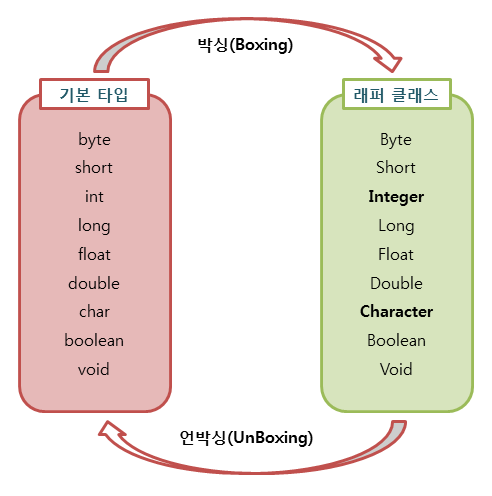
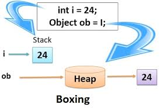
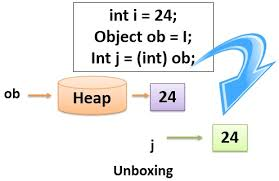

## Wrapper Class

#### Wrapper Class란?

primitive type을 reference type으로 사용해야 하는 경우 primitive type을 obejct로 wrapping해주는 클래스


#### JAVA Wrapper Class

모든 Wrapper class는 java.lang 패키지에 정의

| primitive type | reference type |
| -------------- | -------------- |
| byte           | Byte           |
| short          | Short          |
| int            | Integer        |
| long           | Long           |
| float          | Float          |
| double         | Double         |
| char           | Charater       |
| boolean        | Boolean        |
| void           | Void           |

다른 wrapper class와 달리 void 클래스는 실체화될 수 없으며 단지 공 참조 개념을 나타냄


#### Boxing과 UnBoxing

Wrapper 클래스는 산술연산을 위해 정의된 클래스가 아니기 때문에, 이 클래스의 인스턴스에 저장된 값은 변경이 불가능하며, 값을 저장하는 새로운 객체의 생성 및 참조만 가능하다.



* Boxing

  

  * 기본 자료형을 Wrapper 클래스의 객체로 변경

    ```java
    Integer a = new Integer(30);
    ```

* UnBoxing

  

  * 객체를 기본 자료형으로 변환

    ```java
    Integer a = new Integer(30);
    int b = a.getIntValue();
    ```


#### AutoBoxing과 AutoUnBoxing

AutoBoxing과 AutoUnBoxing 은 단지 기본형 타입과 상응하는 Wrapper class에만 일어난다. 다른 경우에 대입을 시도하면 컴파일 에러가 발생한다.

* AutoBoxing

  * 자동으로 기본자료형을 Wrapper 클래스의 객체로 변경

    ```java
    Integer a = 61;
    ```

* AutoUnBoxing

  * 자동으로 객체를 기본자료형으로 변환

    ```java
    Integer a = new Integer(10);
    int b = a;
    ```

    ​