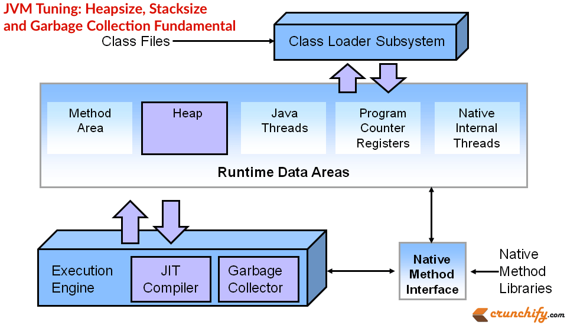
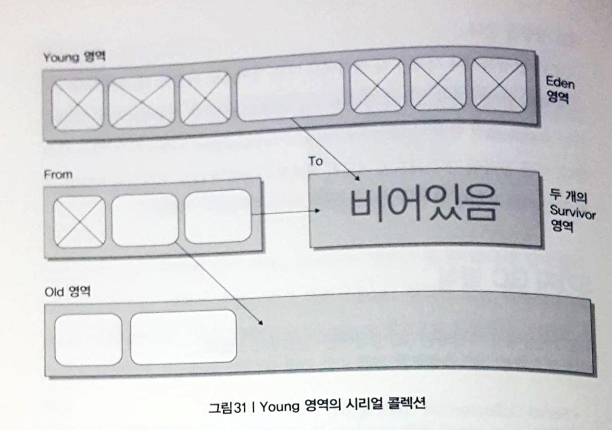
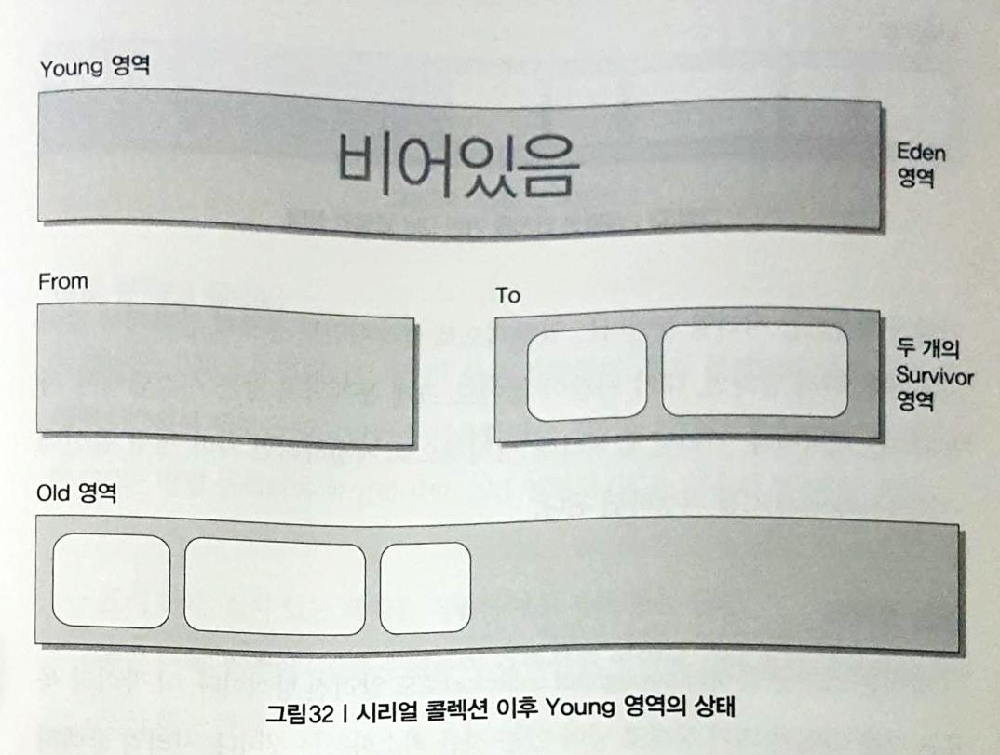
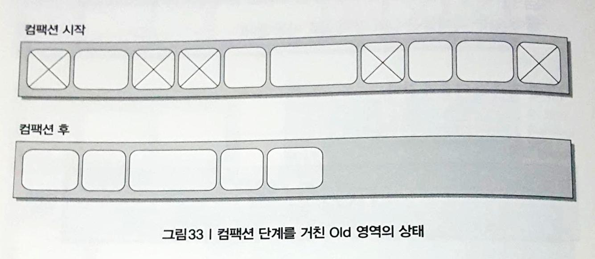
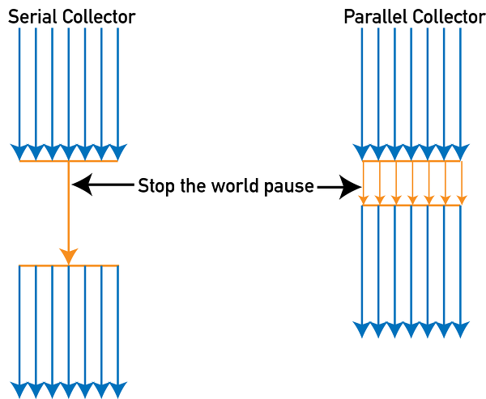
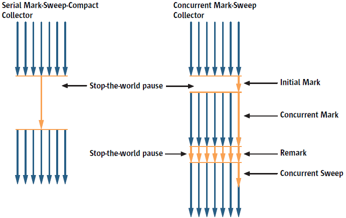
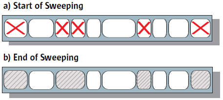

## Story17 도대체 GC는 언제 발생할까?

### GC란?

* automic memory management
* 한정된 공간의 메모리가 꽉 찼을 때 더 이상 필요 없는 객체들을 제거하는 작업
* 사용하지 않는 객체를 메모리에서 제거하는 작업
* 개발자가 메모리를 처리하기 위한 로직을 만들 필요가 없으며 만들어서도 안 됨

* full gc를 소화하는 시점에는 해당 JVM에서 처리되지 않음
* GC를 많이 하면 할수록 응답시간에 많은 영향을 끼침

### 자바의 Runtime data area는 이렇게 구성된다

#### Java Memory Area

* PC 레지스터, JVM 스택, 힙(Heap), 메서드 영역, 런타임 상수(constant) 풀, 네이티브 메서드 스택
* GC가 발생하는 영역은 Heap

  

* Class Loader Subsystem

  * 클래스나 인터페이스를 JVM으로 로딩

* Execution Engine(실행 엔진)

  * 로딩된 클래스의 메서드들에 포함되어 있는 모든 instruction(명령어) 정보를 실행

* Heap Memory (=Shared Memory)

  * 여러 스레드에서 공유하는 데이터들이 저장
  * JVM이 시작될 때 생성
  * 저장되는 데이터 : class instacne, array

* Non-Heap Memory

  * 자바 내부 처리를 위해서 필요한 영역

  * Method Area

    * JVM이 시작될 때 생성

    * 모든 JVM 스레드에서 공유

    * 저장되는 데이터 : Runtime Constant Pool(런타임 상수 풀), 메서드 데이터, 메서드와 생성자 코드

      > Runtime Constant Pool : 자바 클래스 파일에는 constant_pool이라는 정보가 포함되어 있는데, 실행 시에 이를 참조하기 위한 영역
      >
      > 실제 상수 값, 실행시에 변하게 되는 참조 정보, 메서드 데이터, 메서드와 생성자 코드

  * Java Threads (JVM stack)

    * 스레드가 시작할 때 생성

    * 저장되는 데이터 : 메서드가 호출되는 정보인 프레임(frame), 지역 변수, 임시 결과, 메서드 수행과 리턴에관련된 정보 

      > Stack의 크기는 고정하거나 가변적일 수 있음
      >
      > 만약 연산을 하다가 jvm의 스택 크기의 최대치를 넘어섰을 경우에는 StackOverflowError 발생
      >
      > 가변적일 경우 stack의 크기를 늘이려고 할 때 메모리가 부족하거나, 스레드를 생성할 때 메모리가 부족한 경우에는 OutOfMemoryException 발생

  * Program Counter(PC) Register

    * 자바의 스레드들은 각자의 Program Counter(PC) register를 가짐
    * native code를 제외한 모든 java code들이 수행될 때 JVM의 instruction 주소를 pc register에 보관

  * Native Internal Threads (Native method stack)

    * java code가 아닌 다른 언어로 된(보통은 C) 코드들이 실행하게 될 떄의 스택 정보를 관리

### GC의 원리

#### Garbage Collector의 역할

1. 메모리 할당

2. 사용 중인 메모리 인식

3. 사용하지 않는 메모리 인식

   > 사용하지 않는 메모리를 인힉하는 작업을 수행하지 않으면, 할당한 메모리 영역이 꽉 차서 JVM에 행(Hang)이 걸리거나, 더 많은 메모리를 할당하려는 현상이 발생
   >
   > > 행(Hang) : 서버가 요청을 처리 못하고 있는 상태
   > >
   > > hang <<美 속어>> (컴퓨터가) 정체하다, 움직이지 않게되다.
   >
   > 만약 JVM의 최대 메모리 크기를 지정해서 전부 사용한 다음, GC를 해도 더 이상 사용 가능한 메모리 영역이 없는데 계속 메모리를 할당하려고 하면 OutOfMemoryError가 발생하여 JVM이 다운될 수 있음

### Heap Area

.jpg)

* Young

  * Young = Eden + Survivor1 + survivor2
  * 두 개의 Survivor 영역 존재
    * 두 영역 사이에는 우선순위는 존재하지 않음
    * 두 개의 영역 중 한 영역은 반드시 비어있어야 함

* Old

* Perm

  * JDK 8부터 사라짐

  * 거의 사용이 되지 않는 영역

  * 클래스와 메서드 정보, intern된 String 정보

    > intern된 String 정보
    >
    > String 클래스에는 intern() 이라는 메서드가 존재
    >
    > 이 메서드를 호출하면 해당 문자열의 값을 바탕으로 한 단순 비교가 가능
    >
    > 참조 자료형은 equals() 메서드로 비교해야 하지만, intern() 메서드가 호출된 문자열들은 == 비교가능
    >
    > 따라서, 값 비교 성능은 빨라지지만, 문자열 정보들이 Perm 영역에 들어가기 때문에 Perm 영역의 GC가 발생하는 원인이 되기도 함

#### Heap Area (after JDK 8)

.jpg)

.jpg)

* JDK8 이후는 perm 영역이 사라지고 Meta space 영역으로 대체됨
* 참고자료
  * https://yckwon2nd.blogspot.kr/2015/03/java8-permanent.html
  * https://dzone.com/articles/java-8-permgen-metaspace
  * http://netframework.tistory.com/entry/Java8-PermGen%EC%97%90%EC%84%9C-Metaspace%EB%A1%9C

#### 메모리에 객체가 할당되는 과정

1. 메모리에 객체가 생성되면, Eden에 할당됨
2. Eden 영역에 데이터가 꽉 차면 비어있는 Survivor 영역으로 GC 후 살아남아 있는 객체가 할당됨
   * 객체의 크기가 Survivor 영역의 크기보다 큰 경우 바로 Old 영역으로 할당됨
3. Survivor 영역이 차면 GC 후 살아남은 Eden 영역과 꽉 찬 Survivor 영역의 객체가 비어있는 Survivor 영역으로 할당됨 
4. Survivor 1과 2를 왔다 갔다 하던 객체들은 Old 영역으로 이동됨 

### GC의 종류

1. minor GC : Young 영역에서 발생하는 GC
2. major GC : Old 영역이나 Perm 영역에서 발생하는 GC

* GC 방식에 따라 두 가지 GC가 어떻게 상호작용 하느냐도 달라지며 성능에도 영향을 줌
* 스레드 로컬 할당 버퍼(TLABs : Thread-Local Allocation Buffers)
  * GC가 발생하거나 객체가 각 영역에서 다른 영역으로 이동할 떄 애플리케이션의 병목이 발생하면서 성능에 영향을 주게 됨 -> 핫 스팟(Hot spot) JVM에서는 TLABs를 이용하여 스레드별 메모리 버퍼를 사용해서 다른 스레드에 영향을 주지 않는 메모리 할당 작업을 가능하게 함

### 5가지 GC 방식

Serial Collector, Parallel Collector, Parallel Compacting Collector, Concurrent Mark-Sweep Collector, Garbage First Collector

#### Serial Collector (시리얼 콜렉터)

* Young 영역과 Old 영역이 시리얼하게(연속적으로) 처리

* 하나의 CPU를 사용

* GC가 수행될 때 Stop-the-world 발생

  > Stop-the-world
  >
  > GC을 실행하기 위해 JVM이 애플리케이션 실행을 멈추는 것
  >
  > stop-the-world가 발생하면 GC를 실행하는 쓰레드를 제외한 나머지 쓰레드는 모두 작업을 추고 GC 작업을 완료한 이후에야 중단했던 작업을 다시 시작
  >
  > 어떤 GC 알고리즘을 사용하더라도 stop-the-world는 발생
  >
  > 대개의 경우 GC 튜닝이란 이 stop-the-world 시간을 줄이는 것

* 사용

  * 대기 시간이 많아도 크게 문제 되지 않는 클라이언트 종류의 장비
  * -XX:+UseSerialGC

* minor GC

  

  

  1. 살아 있는 객체들은 Eden 영역에 존재 (위의 그림에서 각각의 둥근 사각형이 객체 하나)
  2. Eden 영역이 꽉 차게 되면 Eden 영역과 From Survivor영역의 살아 있는 객체가 비어있는 Survivor 영역인 To Survivor 영역으로 이동
     * 이 때 Survivor 영역에 들어가기에 너무 큰 객체는 바로 Old 영역으로 이동
  3. To Survivor 영역이 꽉 찼을 경우, Eden 영역이나 From Survivor 영역에 남아 있는 객체들은 Old 영역으로 이동

* magor GC : Mark-sweep-compact Collection Algorithm

  

  * 쓰이지 않는 객체를 표시해서 삭제하고 한 곳으로 모으는 알고리즘
  * 표시 단계(Mark) : Old 영역으로 이동도니 객체들 중 살아 있는 객체를 식별
  * 스윕 단계(Sweep) : Old 영역의 객체들을 훑는 작업을 수행하여 garbage object를 식별
  * 컴팩션 단계(Compaction) : 필요 없는 객체들을 지우고 살아 있는 객체들을 한 곳으로 모음

#### Parallel Collector (병렬 콜렉터)

* throughput collector (스루풋 콜렉터)
* 다른 CPU가 대기 상태로 남아 있는 것을 최소화 하는 것
* 사용
  * 여러 CPU를 사용하는 서버에 적합
  * -XX:+UseParallelGC
* minor gc
  * Serail Collector와 달리 병렬(parallel)로 처리
  * Serail Collector에 비해 Stop-the-world 상태가 짧음
  * 많은 CPU를 사용하기 때문에 부하를 줄이고 애플리케이션의 처리량을 증가시킬 수 있음
* major gc
  * Serial Collector와 마찬가지로 Mark-sweep-compactor 콜렉션 알고리즘 사용

#### Parallel Compacting Collecotr (병렬 콤팩팅 콜렉터)

* 사용

  * JDK 5.0 업데이트 6부터 사용 가능
  * 여러 CPU를 사용하는 서버에 적합
  * -XX:+UseParallelOldGC
  * -XX:ParallelGCThread=n (스레드 개수 조정)

* minor gc

  * Parallel Collector와 동일

* major gc

  * Parallel Collector와 다른 알고리즘을 가짐

  1. 표시 단계(Mark) : 살아 있는 객체를 식별하여 표시해 놓는 단계

  2. 종합 단계(Summary) : 이전에 GC를 수행하여 컴팩션된 영역에 살아 있는 객체의 위치를 조사하는 단계

     > Serial Collector와 Parallel Collector의 Major gc와의 차이점은 2단계임
     >
     > 스윕(Sweepe)단계 : 단일 스레드가 Old 영역 전체를 훑음
     >
     > 종합(Summary)단계 : 여러 스레드가 Old 영역을 분리하여 훑음. 게다가 앞서 진행된 GC에서 컴팩션된 영역을 별도로 훑음

  3. 컴팩션 단계(Compcation) : 컴팩션을 수행하는 단계. 수행 이후에는 컴팩션된 영역과 비어있는 영역으로 나뉨

#### Concurrent Mark-Sweep (CMS) Collector (CMS 콜렉터)

* low-latency collecotr (로우 레이턴시 콜렉터)

* 사용

  * heap memory의 크기가 클 때 적합
  * 2개 이상의 프로세서를 사용하는 서버에 적당 ex) 웹서버
  * -XX:+UseConcMarkSweepGC
  * -XX:+CMSIncrementalMode
    * minor gc를 더 잘게 쪼개어 서버의 대기시간을 줄이는 점진적인 방식을 지원하는데 이를 사용하기 위한 옵션
    * CPU가 많지 않고 시스템의 대기 시간이 짧아야 할 때 사용하면 좋음
    * JVM에 따라서는 -Xincgc 라는 옵션도 같은 의미가 되지만, 이 옵션을 지정하면 예기치 못한 성능상 저하가 발생할 수 있으므로 충분한 테스트를 한 후 운영 서버에 적용해야 함 *이 옵션이 Xincgc만 인지 CMS포함인지는 모르겠음*
  * -XX:CMSInitiatingOccupancyFraction = n (Old 영역의 % 지정)

* minor gc

  * parallel collector와 동일

* major gc

  

  1. 초기 표시 단계(Initail Mark) : 매우 짧은 대기 시간으로 살아 있는 객체를 찾는 단계

  2. 컨커런트 표시 단계(Concurrent Mark) : 서버 수행과 동시에 살아 있는 객체에 표시를 해 놓는 단계

  3. 재표시 단계(Remark) : 컨커런트 표시 단계에서 표시하는 동안 변경된 객체에 대해서 다시 표시하는 단계

  4. 컨커런트 스윕 단계(Concurrent Sweep) : 표시되어 있는 garbage를 정리하는 단계

     * 위의 사진에서 b단계에서 빗금친부분이 비어있고 흰색부분이 살아있는 객체

  * CMS Collector는 컴팩션 단계를 거치지 않기 때문에 왼쪽으로 메모리를 몰아놓는 작업을 수행하지 않음 -> major gc 이후에 빈 공간이 발생 하므로 CMS gc가 시작되는 old 영역의 %를 옵션지정 해둬야 함

#### Garbage First (G1) Collector (G1 콜렉터)

* 사용

  * JDK7부터 정식으로 사용 가능 (JDK6에서는 eary access라고 미리 맛보기로 사용할 수 있지만, 안정적인 상태가 아니므로 사용하지 않는것이 권고됨)

* 특징

  * CMS GC의 단점을 보완하기 위해 만들어 짐

  * 과정이 복잡하지만 성능이 좋음

* 구조

  * 바둑판 모양의 G1 Collector는 각 영역을 region(구역)이라고 함
    - region의 크기는 1MB이며 최대 32MB까지 지정 가능
    - 각 region의 크기는 동일
    - 약 2000개정도
  * G1 Collector와 나머지 Collector(Serial Collector, Parallel Collector, Parallel Compacting Collector, Concurrent Mark-Sweep Collector)의 차이점
    * 나머지 Collector들은 Young(Eden + 2Survivor) 영역과 Old 영역으로 구성되어 있었지만 G1 Collector는 Young 영역과 Old 영역이 물리적으로 나뉘어져 있지 않음
    * 나머지 Collector들은 Young과 Old 영역의 주소가 물리적으로 Linear하게 나열되지만, G1은 region이 각각 Eden, Survivor, Old 영역의 역할을 변경해 가면서 하고, Humongous라는 영역도 포함

* minor gc

  1. 몇 개의 region을 선정하여 Young 영역으로 지정
  2. 이 Linear 하지 않은 region에 객체가 생성되면서 데이터가 쌓임
  3. Young 영역으로 할당 된 region에 데이터가 꽉 차면, GC를 수행
  4. GC를 수행하며서 살아있는 객체들만 Survivor region으로 이동
     * 살아 남은 객체들이 이동된 region은 새로운 Survivor 영역이 됨

  * minor gc가 발생하면 survivor 영역에 계속 쌓다가, 몇 번의 aging 작업을 통해서(Survivor 영역에 있는 객체가 몇 번의 Young GC 후에도 살아 있으면), Old 영역으로 승격

* major gc

  1. 초기 표시(Initial Mark) 단계 (**STW**) : Old 영역에 있는 객체에서 Survivor영역의 객체를 참조하고 있는 객체들을 표시
  2. 기본 구역 스캔(Root region scanning) 단계 :  Old 영역 참조를 위해서 Survivor 영역을 훑음
     * 이 작업은 minor GC가 발생하기 전에 수행 됨
  3. 컨커런트 표시(Concurrent Mark) 단계 : 전체 힙 영역에 살아있는 객체를 찾음
     * 만약 이 때 minor gc가 발생하면 잠시 멈춤
  4. 재 표시(Remark) 단계 (**STW**) : 힙에 살아 있는 객체들의 표시 작업을 완료
     * 이 때 snapshot-at-the-beginning(SATB) 알고리즘을 사용하며, 이는 CMS GC에서 사용하는 방식보다 빠름
  5. 청소(Cleaning) 단계 (**STW**) : 살아 있는 객체와 비어 있는 region을 식별하고, 필요 없는 개체들을 지우고 비어 있는 region을 초기화
  6. 복사(Copy) 단계(**STW**)  : 살아 있는 객체들을 비어 있는 region으로 모음

* reference

  * [Google 'The Garbage-First Garbage Collector'](http://citeseerx.ist.psu.edu/viewdoc/download?doi=10.1.1.63.6386&rep=rep1&type=pdf)
  * [Java 9 Garbage-First Garbage Collector](https://docs.oracle.com/javase/9/gctuning/garbage-first-garbage-collector.htm#JSGCT-GUID-ED3AB6D3-FD9B-4447-9EDF-983ED2F7A573)
  * [Oracle Getting Started with the G1 Garbage Collector](http://www.oracle.com/webfolder/technetwork/tutorials/obe/java/G1GettingStarted/index.html)

### 강제로  GC 시키기

#### 강제로 GC를 발생시키는 방법

1. System.gc()
2. Runtime.getRuntime().gc()

#### 강제로 GC를 발생시키면 안되는 이유

* GC 방식에 관계 없이 GC르 ㄹ수행하는 동안에는 Stop-the-world가 발생하여 애플리케이션의 성능이 저하되므로 시스템 코드에서 강제로 GC를 발생시키면 시스템의 성능 및 응답 속도가 낮아짐

### Summary

* GC는 각 영역에 할당 된 크기의 메모리가 허용치를 넘을 때 수행 됨
* GC는 개발자가 컨트롤 할 영역이 아님

### Reference

* [Java specs](https://docs.oracle.com/javase/specs/)
  * [The Java Virtual Machine Specification, Java SE 9 Edition (Java Memory Areas)](https://docs.oracle.com/javase/specs/jvms/se9/jvms9.pdf)
* [Oracle 메모리 관리 백서(java memory management whitepaper)](http://www.oracle.com/technetwork/java/javase/memorymanagement-whitepaper-150215.pdf)
* [Java Garbage Collector (블로그 정리글)](http://d2.naver.com/helloworld/1329
* [the machanism of garbage collectors in java](http://searene.me/2017/05/07/the-machanism-of-garbage-collectors-in-Java/)

